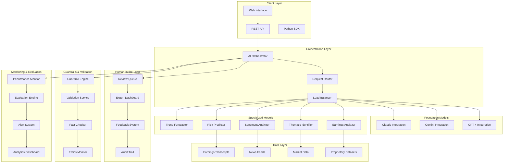

# Hybrid AI Architecture - Design Document

## Overview

The Hybrid AI Architecture implements a sophisticated multi-model system that combines the broad reasoning capabilities of foundation models (GPT-4, Gemini) with highly specialized models trained on proprietary financial datasets. This design follows BlackRock's systematic approach to AI-driven investment management, emphasizing accuracy, reliability, and human-AI collaboration.

## Architecture

### High-Level System Architecture



### Component Architecture

#### 1. AI Orchestrator
- **Purpose**: Central coordination of all AI models and workflows
- **Responsibilities**:
  - Request routing and model selection
  - Response synthesis and conflict resolution
  - Human-in-the-loop workflow management
  - Performance monitoring and optimization

#### 2. Foundation Model Integration
- **GPT-4 Integration**: General reasoning, strategic planning, cross-domain analysis
- **Gemini Integration**: Multimodal analysis, complex reasoning, code generation
- **Claude Integration**: Ethical reasoning, safety-focused analysis, detailed explanations

#### 3. Specialized Model Suite
- **Earnings Analyzer**: Fine-tuned on 400K+ earnings transcripts
- **Thematic Identifier**: Trained on patent data, regulatory filings, market trends
- **Sentiment Analyzer**: Financial news sentiment with market correlation
- **Risk Predictor**: Historical market data and risk factor analysis
- **Trend Forecaster**: Long-term market trend prediction and cycle analysis

## Components and Interfaces

### AI Orchestrator Interface

```python
class AIOrchestrator:
    async def process_request(
        self,
        query: InvestmentQuery,
        context: MarketContext,
        user_profile: UserProfile
    ) -> OrchestrationResult:
        """
        Main entry point for all AI processing requests
        """
        
    async def route_to_models(
        self,
        query: InvestmentQuery,
        routing_strategy: RoutingStrategy
    ) -> List[ModelResponse]:
        """
        Route queries to appropriate model combinations
        """
        
    async def synthesize_responses(
        self,
        responses: List[ModelResponse],
        synthesis_method: SynthesisMethod
    ) -> SynthesizedResult:
        """
        Combine multiple model outputs into coherent response
        """
```

### Specialized Model Interface

```python
class SpecializedModel(ABC):
    @abstractmethod
    async def predict(
        self,
        input_data: ModelInput,
        confidence_threshold: float = 0.7
    ) -> ModelOutput:
        """
        Generate predictions using specialized model
        """
        
    @abstractmethod
    async def validate_output(
        self,
        output: ModelOutput,
        validation_rules: List[ValidationRule]
    ) -> ValidationResult:
        """
        Validate model output against domain-specific rules
        """
        
    @abstractmethod
    async def explain_prediction(
        self,
        prediction: ModelOutput,
        explanation_level: ExplanationLevel
    ) -> Explanation:
        """
        Provide explainable AI insights for predictions
        """
```

### Human-in-the-Loop Interface

```python
class HumanInTheLoopSystem:
    async def submit_for_review(
        self,
        output: ModelOutput,
        expert_type: ExpertType,
        priority: Priority
    ) -> ReviewRequest:
        """
        Submit AI output for human expert review
        """
        
    async def collect_feedback(
        self,
        review_id: str,
        expert_feedback: ExpertFeedback
    ) -> FeedbackResult:
        """
        Collect and process expert feedback
        """
        
    async def update_models(
        self,
        feedback_batch: List[ExpertFeedback]
    ) -> ModelUpdateResult:
        """
        Update models based on expert feedback
        """
```

### Guardrail System Interface

```python
class GuardrailEngine:
    async def validate_output(
        self,
        output: ModelOutput,
        validation_context: ValidationContext
    ) -> GuardrailResult:
        """
        Comprehensive output validation and safety checks
        """
        
    async def detect_hallucination(
        self,
        output: ModelOutput,
        knowledge_base: KnowledgeBase
    ) -> HallucinationResult:
        """
        Detect potential hallucinations in model outputs
        """
        
    async def check_ethics(
        self,
        output: ModelOutput,
        ethical_guidelines: EthicalGuidelines
    ) -> EthicsResult:
        """
        Verify outputs comply with ethical guidelines
        """
```

## Data Models

### Core Data Structures

```python
@dataclass
class InvestmentQuery:
    query_text: str
    query_type: QueryType
    symbols: List[str]
    time_horizon: TimeHorizon
    risk_tolerance: RiskTolerance
    user_context: UserContext
    timestamp: datetime

@dataclass
class ModelOutput:
    model_id: str
    prediction: Any
    confidence: float
    explanation: str
    metadata: Dict[str, Any]
    timestamp: datetime
    validation_status: ValidationStatus

@dataclass
class ExpertFeedback:
    review_id: str
    expert_id: str
    rating: int  # 1-10 scale
    agreement_level: float  # 0-1 scale
    corrections: List[Correction]
    suggestions: List[str]
    timestamp: datetime

@dataclass
class GuardrailResult:
    passed: bool
    violations: List[GuardrailViolation]
    confidence_score: float
    recommendations: List[str]
    timestamp: datetime
```

### Proprietary Dataset Schemas

```python
@dataclass
class EarningsTranscript:
    company_symbol: str
    quarter: str
    year: int
    transcript_text: str
    market_reaction: MarketReaction
    analyst_sentiment: float
    key_metrics: Dict[str, float]
    themes_mentioned: List[str]

@dataclass
class ThematicDataPoint:
    theme_name: str
    data_sources: List[DataSource]
    strength_score: float
    market_correlation: float
    time_series_data: List[TimeSeriesPoint]
    supporting_evidence: List[Evidence]

@dataclass
class MarketSentimentData:
    news_source: str
    headline: str
    content: str
    sentiment_score: float
    market_impact: float
    symbols_mentioned: List[str]
    publication_time: datetime
```

## Error Handling

### Error Classification

1. **Model Errors**
   - Prediction failures
   - Confidence threshold violations
   - Model unavailability

2. **Data Errors**
   - Missing or corrupted input data
   - Data quality issues
   - Real-time data feed failures

3. **Validation Errors**
   - Guardrail violations
   - Hallucination detection
   - Ethics compliance failures

4. **System Errors**
   - Network connectivity issues
   - Resource exhaustion
   - Service timeouts

### Error Handling Strategy

```python
class ErrorHandler:
    async def handle_model_error(
        self,
        error: ModelError,
        fallback_strategy: FallbackStrategy
    ) -> ErrorHandlingResult:
        """
        Handle model-specific errors with appropriate fallbacks
        """
        
    async def handle_validation_error(
        self,
        error: ValidationError,
        escalation_policy: EscalationPolicy
    ) -> ErrorHandlingResult:
        """
        Handle validation failures with human escalation
        """
        
    async def handle_system_error(
        self,
        error: SystemError,
        recovery_strategy: RecoveryStrategy
    ) -> ErrorHandlingResult:
        """
        Handle system-level errors with graceful degradation
        """
```

## Testing Strategy

### Unit Testing
- Individual model component testing
- Guardrail system validation
- Data pipeline integrity checks
- API endpoint functionality

### Integration Testing
- End-to-end workflow testing
- Model orchestration validation
- Human-in-the-loop process testing
- Cross-system data flow verification

### Performance Testing
- Load testing with concurrent requests
- Latency measurement and optimization
- Resource utilization monitoring
- Scalability validation

### Specialized Testing
- Financial accuracy validation
- Regulatory compliance testing
- Ethical guideline adherence
- Hallucination detection effectiveness

### Continuous Evaluation Framework

```python
class ContinuousEvaluator:
    async def run_daily_evaluation(
        self,
        models: List[SpecializedModel],
        test_suite: TestSuite
    ) -> EvaluationReport:
        """
        Run comprehensive daily model evaluation
        """
        
    async def benchmark_against_baseline(
        self,
        model: SpecializedModel,
        baseline_metrics: BaselineMetrics
    ) -> BenchmarkResult:
        """
        Compare current model performance against baselines
        """
        
    async def detect_performance_regression(
        self,
        historical_metrics: List[PerformanceMetric],
        current_metrics: PerformanceMetric
    ) -> RegressionResult:
        """
        Detect performance regressions and trigger alerts
        """
```

## Security and Compliance

### Data Security
- End-to-end encryption for all data in transit
- Encryption at rest for proprietary datasets
- Role-based access control (RBAC)
- Audit logging for all data access

### Model Security
- Model versioning and integrity verification
- Secure model deployment pipelines
- Input sanitization and validation
- Output filtering and sanitization

### Regulatory Compliance
- GDPR compliance for data processing
- Financial services regulations (MiFID II, Dodd-Frank)
- AI governance frameworks
- Explainable AI requirements

### Privacy Protection
- Differential privacy for sensitive data
- Data anonymization techniques
- Consent management systems
- Right to be forgotten implementation

## Deployment Architecture

### Infrastructure Requirements
- Kubernetes cluster for container orchestration
- GPU nodes for model inference
- High-performance storage for datasets
- Redis for caching and session management
- PostgreSQL for structured data
- InfluxDB for time-series data

### Scalability Design
- Horizontal scaling for model inference
- Auto-scaling based on demand
- Load balancing across model instances
- Caching strategies for frequently accessed data

### Monitoring and Observability
- Prometheus for metrics collection
- Grafana for visualization
- ELK stack for log aggregation
- Distributed tracing with Jaeger
- Custom dashboards for AI-specific metrics

This design provides a comprehensive foundation for implementing the BlackRock Aladdin-inspired hybrid AI architecture with proper separation of concerns, robust error handling, and extensive monitoring capabilities.