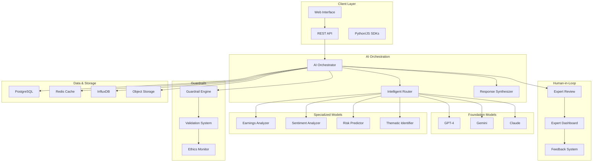

# Hybrid AI Architecture - Documentation Index

## Overview

Welcome to the comprehensive documentation for the Hybrid AI Architecture platform. This documentation provides complete coverage of system architecture, APIs, user guides, troubleshooting procedures, compliance requirements, and training materials.

## Documentation Structure

### 📋 Technical Documentation
- **[System Architecture](technical/system_architecture.md)** - Complete technical overview of the hybrid AI system
  - Core architecture components and data flows
  - Security architecture and deployment specifications
  - Performance targets and monitoring requirements
  - Integration points and maintenance procedures

### 🔌 API Documentation
- **[API Documentation](api/api_documentation.md)** - Complete REST API reference
  - Authentication and authorization
  - Investment analysis endpoints
  - Specialized model APIs (Earnings, Sentiment, Risk, Thematic)
  - Human-in-the-loop workflow APIs
  - Monitoring and analytics endpoints
  - Interactive examples and SDKs

### 👥 User Guides
- **[Expert Interfaces Guide](user_guides/expert_interfaces.md)** - Comprehensive guide for domain experts
  - Expert dashboard navigation and features
  - Review queue management and prioritization
  - Collaborative validation workflows
  - Mobile expert interface usage
  - Performance analytics and feedback systems

### 🔧 Troubleshooting
- **[Runbooks](troubleshooting/runbooks.md)** - Detailed troubleshooting procedures
  - System health monitoring and diagnostics
  - Common issues and resolution steps
  - Emergency response procedures
  - Performance optimization techniques
  - Backup and recovery procedures

### ⚖️ Compliance Documentation
- **[Regulatory Compliance](compliance/regulatory_compliance.md)** - Complete compliance framework
  - SEC, GDPR, MiFID II, and SOX compliance
  - AI-specific regulatory requirements
  - Data governance and privacy protection
  - Audit trails and reporting procedures
  - Incident response and remediation

### 🎓 Training Materials
- **[System Administrator Guide](training/system_administrator_guide.md)** - Comprehensive admin training
  - System architecture and component understanding
  - Installation, configuration, and deployment
  - Monitoring, maintenance, and optimization
  - Security administration and troubleshooting
  - Advanced administration and certification

## Quick Start Guides

### For System Administrators
1. **Setup**: Start with [System Administrator Guide - Module 2](training/system_administrator_guide.md#module-2-installation-and-configuration)
2. **Monitoring**: Configure monitoring using [System Architecture - Monitoring](technical/system_architecture.md#monitoring--observability)
3. **Troubleshooting**: Familiarize yourself with [Runbooks](troubleshooting/runbooks.md)

### For Developers
1. **API Integration**: Begin with [API Documentation](api/api_documentation.md)
2. **Architecture**: Understand the system via [Technical Architecture](technical/system_architecture.md)
3. **SDKs**: Use provided Python/JavaScript SDKs for rapid integration

### For Domain Experts
1. **Getting Started**: Review [Expert Interfaces Guide](user_guides/expert_interfaces.md)
2. **Dashboard**: Learn the expert dashboard features and workflows
3. **Collaboration**: Understand human-AI collaboration processes

### For Compliance Officers
1. **Framework**: Start with [Regulatory Compliance](compliance/regulatory_compliance.md)
2. **Monitoring**: Set up compliance monitoring and reporting
3. **Auditing**: Implement audit trail and documentation procedures

## System Requirements

### Minimum Infrastructure
- **Kubernetes Cluster**: v1.24+ with GPU support
- **CPU**: 32+ cores across cluster
- **Memory**: 128GB+ RAM across cluster
- **GPU**: 4+ NVIDIA A100/V100 GPUs for model inference
- **Storage**: 1TB+ high-performance SSD storage
- **Network**: 10Gbps+ bandwidth

### Software Dependencies
- **Container Runtime**: Docker 20.10+ or containerd 1.6+
- **Database**: PostgreSQL 14+, Redis 7+, InfluxDB 2.0+
- **Monitoring**: Prometheus 2.40+, Grafana 9.0+
- **Service Mesh**: Istio 1.16+ (optional but recommended)

## Architecture Overview

## Key Features

### 🤖 Hybrid AI Architecture
- **Foundation Models**: GPT-4, Gemini, Claude for general reasoning
- **Specialized Models**: Custom fine-tuned models for financial tasks
- **Intelligent Routing**: Optimal model selection based on query type
- **Response Synthesis**: Confidence-weighted combination of model outputs

### 👨‍💼 Human-in-the-Loop
- **Expert Validation**: Domain expert review and validation workflows
- **Collaborative Interfaces**: Real-time collaboration between humans and AI
- **Feedback Integration**: Continuous model improvement from expert feedback
- **Audit Trails**: Complete documentation of human-AI interactions

### 🛡️ Comprehensive Guardrails
- **Output Validation**: Multi-layer validation against trusted sources
- **Hallucination Detection**: Advanced detection of AI hallucinations
- **Ethical Compliance**: Embedded ethical guidelines and monitoring
- **Real-time Processing**: <100ms guardrail processing latency

### 📊 Advanced Analytics
- **Performance Monitoring**: Real-time system and model performance tracking
- **Business Intelligence**: Executive dashboards and ROI analysis
- **Predictive Analytics**: Capacity planning and trend analysis
- **Compliance Reporting**: Automated regulatory compliance reporting

## Support and Resources

### Documentation Updates
This documentation is continuously updated. Check the [changelog](CHANGELOG.md) for recent updates.

### Community and Support
- **GitHub Issues**: [Report bugs and request features](https://github.com/hybrid-ai/platform/issues)
- **Slack Community**: [Join our community](https://hybrid-ai-community.slack.com)
- **Email Support**: support@hybrid-ai.platform.com
- **Enterprise Support**: enterprise@hybrid-ai.platform.com

### Training and Certification
- **Online Training**: [training.hybrid-ai.platform.com](https://training.hybrid-ai.platform.com)
- **Certification Programs**: Available for administrators, developers, and experts
- **Professional Services**: Implementation and optimization consulting

### Status and Updates
- **System Status**: [status.hybrid-ai.platform.com](https://status.hybrid-ai.platform.com)
- **Release Notes**: [releases.hybrid-ai.platform.com](https://releases.hybrid-ai.platform.com)
- **Security Advisories**: [security.hybrid-ai.platform.com](https://security.hybrid-ai.platform.com)

## Contributing to Documentation

### Documentation Standards
- Use clear, concise language appropriate for the target audience
- Include practical examples and code snippets
- Maintain consistent formatting and structure
- Update related documentation when making changes

### Contribution Process
1. **Fork** the documentation repository
2. **Create** a feature branch for your changes
3. **Update** relevant documentation files
4. **Test** examples and procedures
5. **Submit** a pull request with detailed description

### Review Process
All documentation changes undergo peer review to ensure:
- Technical accuracy and completeness
- Clarity and readability
- Consistency with existing documentation
- Proper formatting and structure

---

**Last Updated**: January 2024  
**Version**: 2.1.0  
**Maintained by**: Hybrid AI Platform Team

For questions about this documentation, please contact: docs@hybrid-ai.platform.com